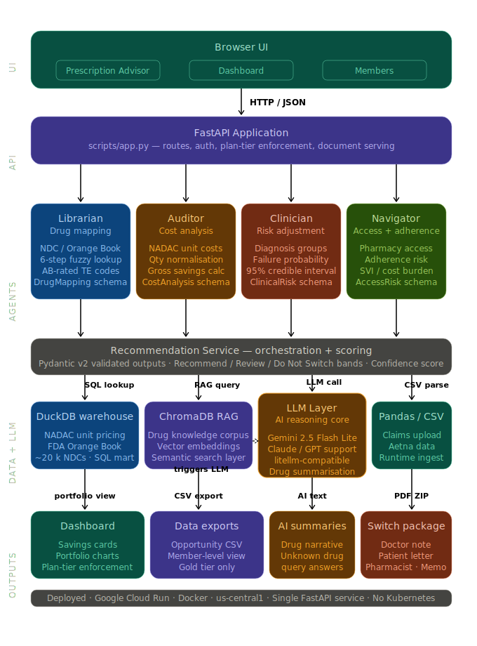

# PharmaFlow AI

> **Live Demo:** [https://pharmaflow-ai-648786197436.us-central1.run.app](https://pharmaflow-ai-648786197436.us-central1.run.app)

---

## What Is This?

**PharmaFlow AI helps insurance companies find expensive brand-name prescription claims that may have lower-cost generic options, estimate savings, and create doctor/patient review documents before any switch is made.**

It ingests a payer's claims CSV, runs each brand-name drug through a four-agent AI pipeline, and outputs a ranked list of generic switch opportunities with full clinical risk, adherence risk, access risk, and confidence scores — packaged into ready-to-use review documents for doctors, patients, and pharmacists.

PharmaFlow AI does not automatically tell a patient to switch medicine. Instead, it finds possible savings opportunities and packages them for human review. The insurer can then ask a doctor, pharmacist, or clinical team to review whether the patient can safely move from the brand drug to the generic alternative.

> **All member data is de-identified. Source: Aetna (redacted). Not a medical device. Not clinical decision support.**

---

## The Business Case

### Who Uses This

| Customer | Concrete User | Problem Today | Why They Pay |
|----------|--------------|---------------|--------------|
| **Primary: insurance company / health plan** | Pharmacy analytics analyst, medical economics analyst, or pharmacy benefit director | Claims are available, but it is hard to quickly know which brand-drug claims have a cheaper generic option and which require clinical review. | If the plan saves even a small amount per member, it can reduce drug spend, improve margins, and potentially support more competitive insurance pricing. |
| **Secondary: PBM or benefits team** | Formulary manager or client service lead | They need a simple way to explain savings opportunities and review exceptions. | The tool creates a repeatable review process instead of one-off manual spreadsheet work. |
| **Indirect: patients and doctors** | Patient, physician, pharmacist | They may not see total plan cost or generic options at the right time. | They benefit from clearer, safer cost conversations, but they are not the main buyer. |

**Example business value:** if an insurer finds that 500 members are using a high-cost brand drug and a doctor-reviewed generic option saves even $40/member/month, that is $20,000 in monthly savings on one opportunity. Across many drugs and members, the savings can become meaningful enough to lower costs, improve the plan's financial position, and help the insurer serve more members.

### The Problem

US payers spend **$200B+ annually** on brand-name drugs when FDA-approved generic equivalents exist at a fraction of the cost. The challenge is not *finding* the generics — it is knowing **which switches are safe, accessible, and net-positive** after accounting for:

- **Clinical risk**: Will the member have a medical event if they switch?
- **Adherence risk**: Will the member stop taking the drug if they switch?
- **Access risk**: Can the member actually get the alternative drug at their pharmacy?

Manual review by pharmacists costs $80–$150/hour and can only cover a tiny fraction of a payer's book of business. PharmaFlow AI automates the triage.

### Monetization

| Plan | Price / Month | Best For | Included | Not Included |
|------|--------------|----------|----------|--------------|
| **Bronze** | $500 | Small plan doing a quick savings scan | Brand-vs-generic opportunity list; gross savings estimate; dashboard summary | No member-level view; no downloads; no clinical risk or access risk flags |
| **Silver** | $1,200 | Payer team that wants safer prioritization | Everything in Bronze + clinical-risk and access-risk summaries, Recommend/Review/Do Not Switch bands, portfolio charts | No member-level details; no CSV export; no switch-package document download |
| **Gold ★** | $2,500 | Insurance company ready to act on findings | Everything in Silver + member-level view, CSV export, and four switch-package documents: doctor review note, patient explanation, pharmacist outreach letter, internal payer/formulary memo | No real-time rebate modeling unless added as enterprise integration |

### Unit Economics

| Item | Bronze | Silver | Gold |
|------|--------|--------|------|
| Monthly price | $500 | $1,200 | $2,500 |
| Expected cloud + database cost | $60 | $90 | $150 |
| Expected LLM/token cost | $1–$5 | $3–$10 | $10–$30 |
| PDF/export generation cost | $0 | $0 | $25–$75 |
| Support + monitoring allowance | $100 | $200 | $350 |
| **Estimated total cost to serve** | **$161–$165** | **$293–$300** | **$535–$605** |
| **Approx. gross margin** | **~67%** | **~75%** | **~75%** |

**Token economics:** 1,000 analyzed opportunities use ~4,000 input + 1,000 output tokens each → ~4M input + 1M output tokens total. At a low-cost flash model (~$0.10/1M input, ~$0.40/1M output), the LLM bill is under $1 for core analysis. PharmaFlow is not token-heavy because the expensive work is done by DuckDB lookups, pricing formulas, and structured outputs.

**Break-even logic:** Gold only needs one or two meaningful switch opportunities to justify its price. If the product helps the insurer safely review 100 members where the net saving is $75/member/month, that is $7,500/month in potential savings versus a $2,500/month Gold subscription.

**Where the economics break:** The economics break if the customer is too small, uploads too few claims, or uses the product only for reports without
acting on any switch opportunities. For example, if a Gold customer pays $2,500/month but only identifies $1,000/month of realistic savings, the
product is not justified. The model works best when the payer has enough monthly claim volume and enough brand-drug spend for even a small
number of safe switches to exceed the subscription price.

---

## Live Demo

**[→ Open PharmaFlow AI](https://pharmaflow-ai-648786197436.us-central1.run.app)**

### Quick Demo Script

**1. Single drug lookup (Prescription Advisor tab)**
```
Provigil
```
Returns: Modafinil, ~$1,000–$2,400 gross savings/fill cycle, AB-rated generic equivalent.

**2. Natural language query**
```
What can Abilify be replaced with that is cheaper?
```

**3. Multi-drug lookup**
```
Abilify, Lyrica, Diovan
```

**4. Upload a claims CSV**
Upload `data/demo/demo_claims_high_savings.csv` — full portfolio analysis with 10-second animated processing.

**5. Switch to Dashboard tab**
- See portfolio-level savings cards and three charts
- Switch plan from Gold → Silver → Bronze to see tier enforcement
- Expand any row for full agent breakdown (Librarian / Auditor / Clinician / Navigator)
- On Gold: click **Download Switch Package** → 4-PDF ZIP

---

## Architecture



---

## Four Agents

### 1. Librarian Agent — Drug Mapping
Maps brand drug names to FDA-approved generic equivalents using the Orange Book and NADAC warehouse.

- 6-step lookup: exact NDC → ingredient prefix → fuzzy match
- Classifies: `GENERIC_EQUIVALENT` (AB-rated TE code) | `THERAPEUTIC_ALTERNATIVE` | `NO_ALTERNATIVE`
- Output schema: `DrugMapping` — source drug, candidate alternative, TE code, dosage form, strength, mapping confidence, reason codes
- **File:** `scripts/agents/librarian_agent.py`

### 2. Auditor Agent — Cost Analysis
Calculates gross pharmacy savings using NADAC unit costs.

- Normalizes claim quantity to NADAC pricing unit (EA / ML / GM)
- Formula: `gross_savings = (brand_unit_cost − generic_unit_cost) × normalized_qty`
- Synthetic PBM spread estimate: `spread = gross_savings × 8%`
- Output schema: `CostAnalysis` — unit costs, normalized quantity, gross savings, spread estimate
- **File:** `scripts/agents/auditor_agent.py`

### 3. Clinician Agent — Risk Adjustment
Estimates risk-adjusted total cost of care.

| Diagnosis Group | Base Failure Rate |
|----------------|------------------|
| MENTAL_HEALTH | 22% |
| ONCOLOGY | 28% |
| CARDIOVASCULAR | 12% |
| RESPIRATORY | 14% |
| DIABETES | 10% |
| MUSCULOSKELETAL | 8% |
| GASTROINTESTINAL | 9% |

- Adjusts for: prior switch failure flag (2.5× multiplier), TE code confidence
- 95% credible interval: ±30% of point estimate
- Output schema: `ClinicalRisk` — risk score, failure probability, medical cost delta, risk-adjusted savings, CI
- **File:** `scripts/agents/clinician_agent.py`

### 4. Social Navigator Agent — Access & Adherence
Assesses whether the member can realistically make the switch.

- Flags: `LOW_PHARMACY_ACCESS` (score < 0.40), `PREFERRED_PHARMACY_UNAVAILABLE`, `HIGH_ADHERENCE_RISK`
- Access override: any access flag escalates "Recommend" → "Review"
- Output schema: `AccessRisk` — pharmacy access score, adherence risk, preferred pharmacy availability, access override
- **File:** `scripts/agents/social_navigator_agent.py`

---

## Recommendation Bands

| Band | Condition |
|------|-----------|
| **Recommend** | risk_adjusted_savings > 0 AND clinical_risk < 30% AND pharmacy_access > 60% |
| **Review** | Savings exist but clinical or access uncertainty is meaningful |
| **Do Not Switch** | risk_adjusted_savings ≤ 0 OR safety/access flags are high |

All thresholds in one place: `scripts/services/scoring_service.py → THRESHOLDS`.

---

## Savings Formula (4-Stage Refinement)

```
Stage 1 (Auditor):
    gross_savings = (brand_unit_cost − generic_unit_cost) × normalized_qty

Stage 2 (Clinician):
    medical_delta = switch_failure_probability × estimated_event_cost

Stage 3 (Clinician):
    adherence_penalty = (1 − adherence_score) × $150

Stage 4 (Scoring):
    risk_adjusted_savings = gross_savings − medical_delta − adherence_penalty
    → classify as Recommend / Review / Do Not Switch
```

The final band only emerges after all four agents have run. Every number is traceable to a deterministic Python formula — the LLM never touches the math.

---

## Class Concepts Applied

PharmaFlow AI uses a custom lightweight agent framework: recommendation_service.py acts as the orchestrator, each specialist agent exposes a typed tool function, and all inter-agent outputs are validated through Pydantic schemas.

### Module 1 — LLMs, Prompt Engineering, and Validation

**Role-based messages (system / user / assistant)**
- LLM fallback builds a `[system, ...history, user]` message array with a PBM persona and injected conversation history
- → `scripts/services/drug_mapping_service.py` → `_llm_fallback()`

**Model adapters (LiteLLM)**
- All LLM calls route through `litellm.completion()` — swap `vertex_ai/gemini-2.5-flash-lite`, `anthropic/claude-*`, or `openai/gpt-*` via one `.env` line
- → `scripts/services/drug_mapping_service.py` · `scripts/app.py` → `_llm_classify_query()`

**Context / message history / session**
- Server: per-session history keyed by UUID (`session_id`), capped at 5 turns in `_chat_sessions`, sent with every LLM call
- Client: `chatHistory` (10-turn cap) + full thread HTML persisted in `sessionStorage` across tab navigations
- → `scripts/app.py` → `_chat_sessions` · `frontend/static/js/chat.js` → `saveSessionState()`, `restoreSessionState()`

**Deterministic evaluation metrics**
- 47 tests: savings formulas, unit normalization, risk scoring, band classification, API schema validation, drug name extraction
- All pass with no LLM calls — pure deterministic Python
- → `evals/test_deterministic.py`

**In-context learning and few-shot prompting**
- `_llm_classify_query` uses a structured system prompt with a JSON output contract to extract drug names or return an out-of-scope reply
- No fine-tuning required — behavior shaped entirely through prompt design
- → `scripts/app.py` → `_llm_classify_query()`

---

### Module 2 — Tools, Frameworks, and Data

**RAG pipeline (chunk → index → retrieve → generate)**
- 30 drug knowledge chunks embedded locally via `sentence-transformers/all-MiniLM-L6-v2`
- ChromaDB retrieves top-3 relevant chunks when a drug is not in the warehouse, injects into LLM system prompt
```
DuckDB warehouse (6 lookup steps)
        ↓ not found
ChromaDB RAG (top-3 chunks → injected into LLM system prompt)
        ↓ retrieval failure
NO_ALTERNATIVE returned (deterministic fallback)
```
- → `scripts/services/rag_service.py` · `scripts/services/drug_mapping_service.py`

**Tool contracts and schema validation**
- Every agent emits a typed Pydantic v2 model: `DrugMapping`, `CostAnalysis`, `ClinicalRisk`, `AccessRisk`
- LLM fallback: validates JSON with `model_validate_json()`, retries once on failure, returns deterministic result on second failure
- → `scripts/models/schemas.py` , `scripts/agents/librarian_agent.py`, `auditor_agent.py`, `clinician_agent.py`, `social_navigator_agent.py`

**Text-to-SQL / NL-to-SQL**
- `_extract_drug_names()`: tokenizes query → filters stop words → DuckDB prefix validation (`LIKE 'KEY%'`)
- `_is_nondrug_query()`: regex classifier rejects geography/general-knowledge before any DB hit
- → `scripts/app.py` → `_extract_drug_names()`, `_is_nondrug_query()`

**Code execution (interpreter pattern)**
- pandas parses uploaded claims CSV at request time, normalizes columns, runs 4-agent pipeline per row, aggregates results
- No pre-processing or background jobs
- → `scripts/app.py` → `chat_analyze()` , `scripts/services/recommendation_service.py`

**Multiple data retrieval paths**
- DuckDB SQL — NADAC + Orange Book warehouse
- ChromaDB vector search — drug knowledge RAG
- pandas CSV — member claims uploaded at runtime
- → `scripts/services/data_service.py` , `scripts/services/rag_service.py` , `scripts/app.py`

---

### Module 3 — Thinking and Planning

**Artifacts**
- 4-PDF Switch Package (Gold only) via `reportlab`, zipped as `switch_package_{id}.zip`:
  1. Internal Utilization Management Memo — internal payer team
  2. Prescriber Clinical Review Letter — doctor
  3. Member Benefit Letter — patient
  4. Pharmacy Network Alignment Notice — dispensing pharmacy
- CSV export at `/api/export/opportunities.csv` for payer workflow integration
- → `scripts/services/document_service.py` · `scripts/app.py` → `/api/documents/{id}`, `/api/export/opportunities.csv`

**State, memory, and persistence**
- Server: `_chat_sessions` dict — UUID-keyed, 5-turn cap, in-memory
- Client: `sessionStorage` saves full thread HTML, sidebar stats, band pills, and LLM history on every tab switch
- Restored on page load — switching between Dashboard, Members, and Chat never loses state
- Cleared only on "New Session" or plan cohort change
- → `scripts/app.py` → `_chat_sessions` · `frontend/static/js/chat.js` → `saveSessionState()`, `restoreSessionState()`, `clearSession()`

**Iterative refinement / Plan-Execute**
- 4-stage sequential pipeline — each stage subtracts a new risk penalty from the running savings estimate
- Stage 1: gross savings (Auditor) → Stage 2: medical cost delta (Clinician) → Stage 3: adherence penalty (Clinician) → Stage 4: access override + band classification (Scoring)
- Cannot be short-circuited; final band only emerges after all four stages
- → `scripts/services/scoring_service.py` · `scripts/services/recommendation_service.py`

**Multi-agent orchestration (orchestrator + specialists)**
- `recommendation_service.py` sequences four specialist agents, collects typed Pydantic outputs, merges into a `Recommendation`, classifies final band
- Each agent has one responsibility and no knowledge of the others
- → `scripts/services/recommendation_service.py` · `scripts/agents/librarian_agent.py`, `auditor_agent.py`, `clinician_agent.py`, `social_navigator_agent.py`

**Parallel portfolio sweep**
- Every claim row in an uploaded CSV is processed independently through the full 4-agent pipeline
- All results collected and aggregated into a single portfolio-level response before returning
- → `scripts/app.py` → `chat_analyze()` (CSV branch)

---

### Module 4 — Agents in the World

**Generative UI / data visualization**
- 3 Chart.js charts, re-render live on every filter change:
  - Savings by Band — gross vs. risk-adjusted across Recommend / Review / Do Not Switch
  - Clinical Risk Distribution — histogram bucketed by `clinical_risk_score`
  - Top 10 Drugs by Gross Savings — ranked horizontal bar
- → `frontend/static/js/dashboard.js` → `renderCharts()`

**Production deployment**
- Containerized via Docker, deployed to Google Cloud Run with Cloud Build
- Single service hosts API, static UI, and document generation
- Port read from `PORT` env var for Cloud Run autoscaling
- → `Dockerfile` · `cloudbuild.yaml`

---

### EDA Tool Calls

**Statistical aggregation**
- Auditor Agent computes per-row gross savings; scoring service aggregates totals and band distributions across the portfolio
- `/api/dashboard` returns total gross savings, total risk-adjusted savings, band counts via pandas aggregations
- `/api/members` groups by `member_id` — summing claim counts, drug counts, and savings per member
- → `scripts/agents/auditor_agent.py` · `scripts/services/scoring_service.py` · `scripts/app.py`

**Filtering and grouping**
- Live dashboard filters: plan cohort, recommendation band, equivalence type, minimum risk-adjusted savings
- Each filter re-queries `/api/recommendations` with query params (`band`, `equiv_type`, `min_savings`, `plan`) — re-filtered server-side
- Member grouping aggregates all recommendations per `member_id` into per-member totals and an `overall_band`
- → `scripts/app.py` → `/api/recommendations` · `frontend/static/js/dashboard.js` → `applyFiltersAndRender()`

**Specialist sub-agent as analytical tool call**
- Orchestrator invokes each agent as a typed function call — passes structured input, receives validated Pydantic output
- Clinician Agent acts as a dedicated "risk analyst": applies diagnosis-group failure rates, prior-switch-failure multipliers, computes risk-adjusted savings with a 95% credible interval
- → `scripts/services/recommendation_service.py` → `generate_recommendation()` · `scripts/agents/clinician_agent.py` → `assess_clinical_risk()`

**Code execution — pandas at request time**
- On CSV upload: reads file, normalizes columns, validates required fields, runs 4-agent pipeline row-by-row, aggregates results
- All computation happens within a single request — no pre-processing or background jobs
- → `scripts/app.py` → `chat_analyze()` (CSV branch)

**Text analysis — drug name extraction**
- `_extract_drug_names()`: tokenizes query, filters stop words, validates each token via DuckDB prefix match (`LIKE 'KEY%'`)
- `_is_nondrug_query()`: regex entity classifier rejects geography/general-knowledge queries before any DB hit
- → `scripts/app.py` → `_extract_drug_names()`, `_is_nondrug_query()`, `_is_plausible_drug_name()`

---

### Advanced Techniques

**Iterative refinement loop**
- 4-stage sequential pipeline — each stage adjusts the running savings estimate before passing to the next
- Stage 1 (Auditor): gross savings from NADAC prices
- Stage 2 (Clinician): subtract expected medical cost delta
- Stage 3 (Clinician): subtract adherence penalty
- Stage 4 (Scoring): apply access risk override → classify final band
- Pipeline cannot be short-circuited; final answer only emerges after all four stages
- → `scripts/services/recommendation_service.py` · `scripts/services/scoring_service.py`

**Code execution at runtime**
- pandas reads uploaded CSV, normalizes it, and executes the full pipeline per row at request time
- Arithmetic computed in Python: unit cost normalization, `quantity × price`, `probability × event cost`
- No pre-computed results — every upload triggers a fresh end-to-end run
- → `scripts/app.py` → `chat_analyze()` · `scripts/agents/auditor_agent.py` → `calculate_costs()`

**Artifacts — persistent outputs**
- 4-PDF Switch Package (`reportlab`) zipped as `switch_package_{id}.zip` — ready-to-use operational artifact
- Filtered CSV export at `/api/export/opportunities.csv` — structured output for payer workflow integration
- Both generated on-demand from live recommendations state, not pre-rendered
- → `scripts/services/document_service.py` · `scripts/app.py` → `/api/documents/{id}`, `/api/export/opportunities.csv`

**Structured output with schema validation**
- Every agent emits a typed Pydantic v2 model (`DrugMapping`, `CostAnalysis`, `ClinicalRisk`, `AccessRisk`)
- LLM fallback: response parsed with `model_validate_json()` — retries once with validation error appended before returning deterministic fallback
- Query classifier enforces `{"is_drug_query": bool, "drug_names": list, "reply": str}` on every LLM response
- → `scripts/models/schemas.py` · `scripts/services/drug_mapping_service.py` → `_llm_fallback()` · `scripts/app.py` → `_llm_classify_query()`

**Second distinct data retrieval method**
- Three independent retrieval mechanisms in one pipeline:
  1. DuckDB SQL — NADAC + Orange Book pricing and equivalence lookups
  2. ChromaDB vector search — top-3 semantically similar drug knowledge chunks injected into LLM prompt
  3. pandas CSV ingestion — member claims uploaded at runtime
- → `scripts/services/data_service.py` · `scripts/services/rag_service.py` · `scripts/app.py`

**Data visualization**
- 3 Chart.js charts, re-render live on every filter change:
  - Savings by Band — gross vs. risk-adjusted across Recommend / Review / Do Not Switch
  - Clinical Risk Distribution — histogram bucketed by `clinical_risk_score`
  - Top 10 Drugs by Gross Savings — ranked horizontal bar
- Members page: inline HTML risk bars per member from `clinical_risk_score`
- → `frontend/static/js/dashboard.js` → `renderCharts()` · `frontend/static/js/members.js` → `riskBar()`

**Parallel portfolio sweep**
- Each claim row processed independently through the full 4-agent pipeline
- All `Recommendation` objects collected, then aggregated: band counts, total savings, member-level rollups
- Single portfolio-level response returned after all rows complete
- → `scripts/app.py` → `chat_analyze()` (CSV branch) · `scripts/services/recommendation_service.py`

---

### Summary Table

| Class Concept | File(s) |
|---------|---------|
| Role-based messages (system/user/assistant) | `scripts/services/drug_mapping_service.py` |
| Model adapters — LiteLLM | `scripts/services/drug_mapping_service.py`, `scripts/app.py` |
| Context / message history / session | `scripts/app.py`, `frontend/static/js/chat.js` |
| Deterministic evaluation metrics | `evals/test_deterministic.py` |
| In-context learning / few-shot prompting | `scripts/app.py` → `_llm_classify_query()` |
| RAG pipeline (chunk → index → retrieve → generate) | `scripts/services/rag_service.py` |
| Tool contracts + schema validation | `scripts/models/schemas.py`, all agent files |
| Text-to-SQL / NL-to-SQL | `scripts/app.py` → `_extract_drug_names()` |
| Code execution (interpreter pattern) | `scripts/app.py` → `chat_analyze()` |
| Multiple data retrieval methods | `data_service.py`, `rag_service.py`, `app.py` |
| Artifacts (switch package + CSV export) | `scripts/services/document_service.py` |
| State, memory, and persistence | `scripts/app.py`, `frontend/static/js/chat.js` |
| Iterative refinement / Plan-Execute | `scripts/services/scoring_service.py`, `recommendation_service.py` |
| Multi-agent orchestration | `scripts/services/recommendation_service.py` |
| Parallel portfolio sweep | `scripts/app.py` → `chat_analyze()` (CSV branch) |
| Generative UI / data visualization | `frontend/static/js/dashboard.js` |
| Production deployment (Cloud Run) | `Dockerfile`, `cloudbuild.yaml` |
| Statistical aggregation (EDA) | `scripts/services/scoring_service.py`, `scripts/app.py` → `/api/dashboard` |
| Filtering and grouping (EDA) | `scripts/app.py` → `/api/recommendations`, `frontend/static/js/dashboard.js` |
| Specialist sub-agent analytical tool call | `scripts/agents/clinician_agent.py`, `recommendation_service.py` |
| Text analysis — drug name extraction | `scripts/app.py` → `_extract_drug_names()`, `_is_nondrug_query()` |
| Structured output + retry on schema failure | `scripts/services/drug_mapping_service.py`, `scripts/models/schemas.py` |
| Second retrieval method (SQL + RAG + CSV) | `data_service.py`, `rag_service.py`, `app.py` |

---

## Data Sources

| Source | Type | Description |
|--------|------|-------------|
| CMS NADAC | Real public data | National Average Drug Acquisition Cost — unit pricing for ~20,000 NDCs (April 2026) |
| FDA Orange Book | Real public data | Products, patents, exclusivity, TE codes (May 2026) |
| Aetna Claims | De-identified | 500 member claims — realistic field distributions |
| Demo CSVs | Aetna Claims Data (De-identified) | `data/demo/` — high-savings and mixed-risk portfolios for live demo |

Here, all claims data is de-identified. A production version would require HIPAA-compliant storage, audit logs, role-based access control, encryption at rest/in transit, and customer-specific BAA/security review before handling PHI.
---

## API Reference

| Method | Route | Description |
|--------|-------|-------------|
| GET | `/` | Prescription Advisor chat UI |
| GET | `/dashboard` | Payer dashboard |
| GET | `/members` | Member history |
| GET | `/health` | `{"status": "ok"}` |
| GET | `/api/config` | Runtime config (LLM on/off, model name) |
| GET | `/api/dashboard` | Portfolio summary cards |
| GET | `/api/recommendations` | Full opportunity list |
| GET | `/api/members` | Aggregated member stats |
| GET | `/api/members/{id}` | All recommendations for one member |
| POST | `/api/chat/analyze` | Analyze CSV upload or free-text drug query |
| GET | `/api/documents/{id}` | Download 4-PDF switch package as ZIP |
| GET | `/api/export/opportunities.csv` | Export filtered opportunities as CSV |

---

## Local Setup

### Prerequisites
- Python 3.11+
- `uv` (preferred) or pip

### Install & Run

```bash
cd Assignment_3
uv sync

# Copy env defaults (works out of the box — no API keys needed)
cp .env.example .env

# Start server
uv run uvicorn app:app --reload --host 0.0.0.0 --port 8000
```

Open [http://localhost:8000](http://localhost:8000)

### Run Tests

```bash
uv run pytest evals/ -q
# 47 tests, all deterministic, no LLM required
```

---

```bash
# .env
USE_LLM=True
MODEL_NAME=vertex_ai/gemini-2.5-flash-lite

# Authenticate for Vertex AI
gcloud auth application-default login
gcloud config set project YOUR_PROJECT_ID
```

Any litellm-supported model string works: `anthropic/claude-...`, `openai/gpt-...`, `vertex_ai/...`

---

## Cloud Run Deployment

```bash
export GCP_PROJECT_ID=your-project-id
export GCP_REGION=us-central1
export SERVICE=pharmaflow-ai

gcloud services enable run.googleapis.com cloudbuild.googleapis.com artifactregistry.googleapis.com

gcloud builds submit --tag gcr.io/$GCP_PROJECT_ID/$SERVICE

gcloud run deploy $SERVICE \
  --image gcr.io/$GCP_PROJECT_ID/$SERVICE \
  --region $GCP_REGION \
  --allow-unauthenticated \
  --port 8080 \
  --memory 2Gi \
  --set-env-vars DATA_MODE=synthetic,USE_LLM=true,SYNC_DATA_TO_GCS=false

# Validate
SERVICE_URL=$(gcloud run services describe $SERVICE --region $GCP_REGION --format='value(status.url)')
curl "$SERVICE_URL/health"
```

---

## Repository Layout

```
.
├── app.py                              # Entrypoint: from scripts.app import app
├── scripts/
│   ├── app.py                          # FastAPI routes and app wiring
│   ├── agents/
│   │   ├── librarian_agent.py          # Drug mapping
│   │   ├── auditor_agent.py            # Cost/savings analysis
│   │   ├── clinician_agent.py          # Clinical risk adjustment
│   │   └── social_navigator_agent.py   # Access/adherence
│   ├── services/
│   │   ├── data_service.py             # DuckDB connection and queries
│   │   ├── drug_mapping_service.py     # Brand-to-generic lookup + RAG + LLM fallback
│   │   ├── pricing_service.py          # NADAC unit cost retrieval
│   │   ├── scoring_service.py          # Savings formulas and band classification
│   │   ├── recommendation_service.py   # Agent orchestration
│   │   ├── document_service.py         # PDF generation (reportlab)
│   │   └── rag_service.py              # ChromaDB vector store + drug knowledge corpus
│   ├── models/
│   │   └── schemas.py                  # Pydantic v2 schemas
│   └── data/
│       └── synthetic_generator.py      # Synthetic claims generator
├── frontend/
│   ├── templates/
│   │   ├── index.html                  # Dashboard
│   │   ├── chat.html                   # Prescription Advisor
│   │   └── members.html                # Member history
│   └── static/
│       ├── css/styles.css
│       └── js/
│           ├── dashboard.js
│           ├── chat.js
│           └── members.js
├── data/
│   ├── synthetic/claims.csv
│   ├── demo/                           # Demo CSVs for live walkthrough
│   └── warehouse/pharmaflow.duckdb     # DuckDB: NADAC + Orange Book
├── evals/
│   └── test_deterministic.py           # 47 deterministic tests
├── Dockerfile
├── cloudbuild.yaml
├── requirements.txt
├── .env.example
└── DEMO_QUESTIONS.txt
```

---

## Why the Technical Choices Fit the Business

| Technical Choice | Business Reason |
|-----------------|----------------|
| **FastAPI + single web app** | Keeps deployment simple for a class demo and for a small payer. One service hosts the upload flow, dashboard, API, and document downloads. |
| **DuckDB warehouse over NADAC + Orange Book** | Insurance users need fast, repeatable answers. DuckDB gives cheap SQL lookups for pricing and equivalence instead of calling an LLM for every claim. |
| **Four-agent pipeline** | The work naturally separates into four jobs: find the generic, price the switch, check clinical risk, and check access/adherence. This makes the output easier to trust and explain. |
| **Structured Pydantic outputs** | Savings and risk fields are validated before they reach the dashboard. This reduces hallucination risk and makes the result more audit-friendly for healthcare users. |
| **RAG (ChromaDB)** | RAG helps answer unknown-drug questions, but it is not the core pricing engine. That keeps costs low and avoids using the LLM for sensitive calculations. |
| **Gold switch-package artifacts** | The business value is not just finding savings — it is helping the insurer act. Downloadable documents make the product useful inside real payer workflows. |

> **Note:** PharmaFlow AI is decision support, not a medical prescriber. It says "requires doctor/pharmacist review," not "switch this patient." The demo uses de-identified Aetna Claims data. A real customer version would need secure data handling, HIPAA-aware workflows, access controls, audit logs, and contract-specific rebate/formulary integrations.

---

